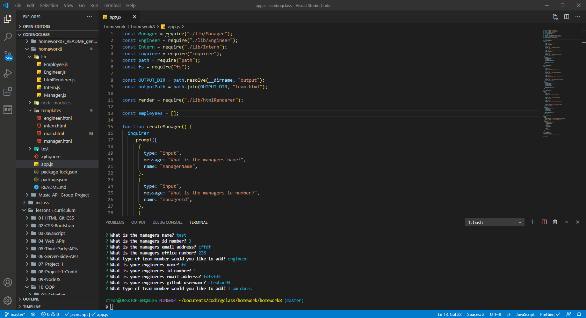

# Team Profile Generator
  

## Description

A software engineering team generator command line application. The application will prompt the user for information about the team manager and then information about the team members. The user can input any number of team members, and they may be a mix of engineers and interns. 

## Table of Contents

* [installation](#installation)
* [usage](#usage)
* [license](#license)
* [contributing](#contributing)
* [test](#tests)
* [questions](#questions)

To install necessary dependencies run the following command

npm i

## Usage

## License
      
      This project is licensed under the MIT license.

## Contributing

N/A

## Tests
To run test run the following command:
'''
npm test
'''

## How the deployed application looks and works

## Questions
If you have any questions about the repo contact me directly at c.trahan94@yahoo.com.
You can find more of my work at [ctrahan94](https://github.com/ctrahan94).

